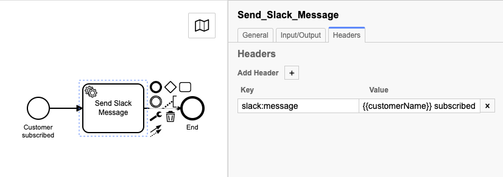

# Zeebe Slack Worker

A Node.js Slack message task worker for Zeebe and Camunda Cloud.

## Usage

Add `zeebe-slack-worker` to your project as a dependency:

```
npm i zeebe-slack-worker
```

In your application code, create a `SlackProfile` with the configuration for your Slack integration, then create a `SlackWorker`: 

```typescript
import { SlackWorker, SlackProfile } from 'zeebe-slack-worker'

const profile: SlackProfile = {
  webhook: process.env.SLACK_WEBHOOK_URL,
  defaultChannel: process.env.SLACK_CHANNEL || "general"
}

const slackworker = new SlackWorker({
    SlackProfiles: { default: profile }
})
```

This code starts a worker that subscribes to tasks of type `slack:message`.

In your BPMN model, add a service task with the type set to `slack:message`. Set a custom header with the key `slack:message` and the value of the message that you want to send to Slack. 



Process variables will be templated into this message string using [micromustache](https://www.npmjs.com/package/micromustache). For example, to template in the variable `customerName`, you would set a `slack:message` custom header on the service task with a value like this: 

```
{{customerName}} subscribed!
```

## More Advanced Usage 

### Sending messages to different channels

To specify a channel other than the default, add a custom header to the service task with the key `slack:channel`, and the value set to the channel you want to send to.

You might use this to send exception messages to a specific channel.

### Use message templates

You can abstract the message string text out of the model by specifying a `slack:template` in a custom header, in place of a `slack:message`. 

This enables you to create complex messages in a editor, and also to refactor them in a way that does not require redeploying the model or restarting process instances. 

To use templates, add templates to the `SlackProfile`:

```typescript
import { SlackWorker, SlackProfile } from 'zeebe-slack-worker'

const profile: SlackProfile = {
  webhook: process.env.SLACK_WEBHOOK_URL,
  defaultChannel: process.env.SLACK_CHANNEL || "general",
  templates: {
      subscribe: `Great news!
      
{{customerName}} has subscribed.`,
      unsubscribe: `{{customerName}} unsubscribed because {{unsubscribeReason}}`
  }
}

const slackworker = new SlackWorker({
    SlackProfiles: { default: profile }
})
```

### Send messages to multiple Slack Teams 

You can send messages to distinct Slack Teams using the same worker, by setting up different profiles.

In the service task, set the custom header `slack:profile` to the key of the profile to use for jobs for that service task.

```typescript
import { SlackWorker, SlackProfile } from 'zeebe-slack-worker'

const templates = {
      subscribe: `Great news!
      
{{customerName}} has subscribed.`,
      unsubscribe: `{{customerName}} unsubscribed because {{unsubscribeReason}}`
}

// Service tasks with `slack:profile` set to `happyPath` send to this Slack team
const happyPath: SlackProfile = {
  webhook: process.env.SLACK_HAPPY_WEBHOOK_URL,
  defaultChannel: process.env.SLACK_CHANNEL || "general",
  templates
}

// Service tasks with `slack:profile` set to `sadPath` send to this Slack team
const sadPath: SlackProfile = {
  webhook: process.env.SLACK_SAD_WEBHOOK_URL,
  defaultChannel: process.env.SLACK_CHANNEL || "general",
  templates
}

const profiles = {
    happyPath,
    sadPath
}

const slackworker = new SlackWorker({
    SlackProfiles: profiles
})
```